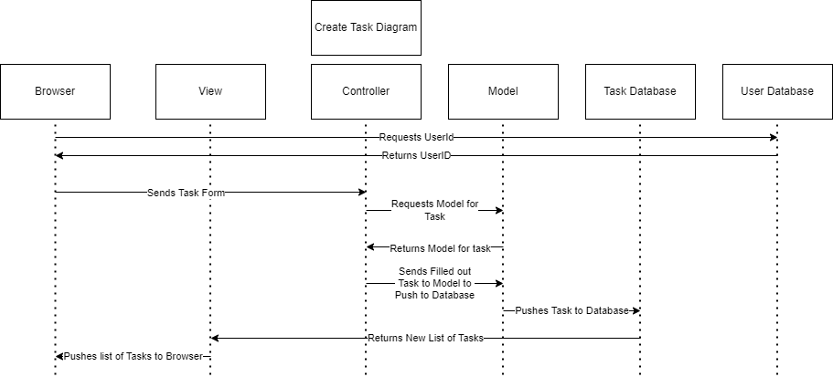
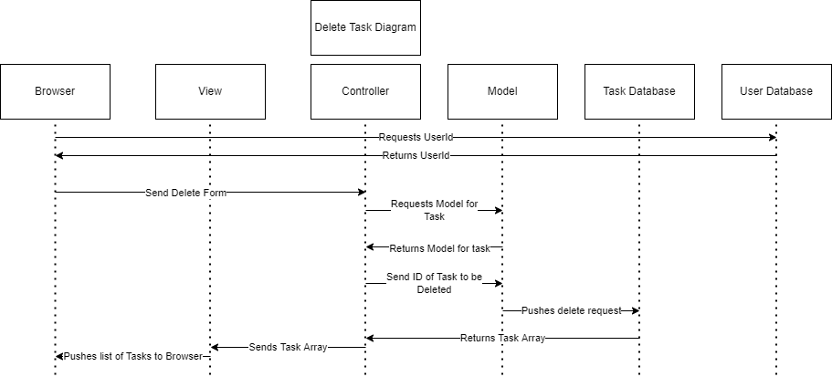
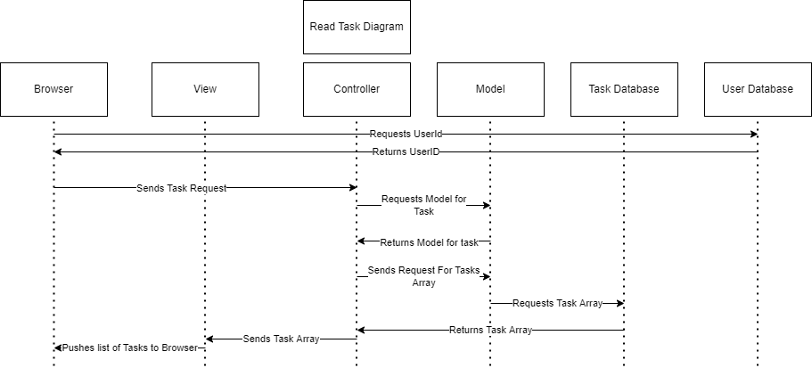
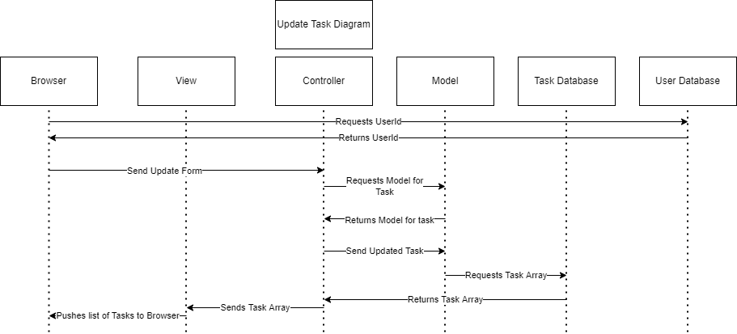
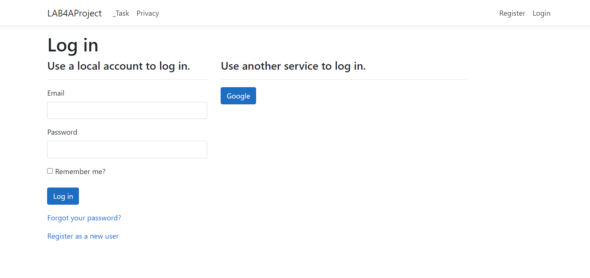
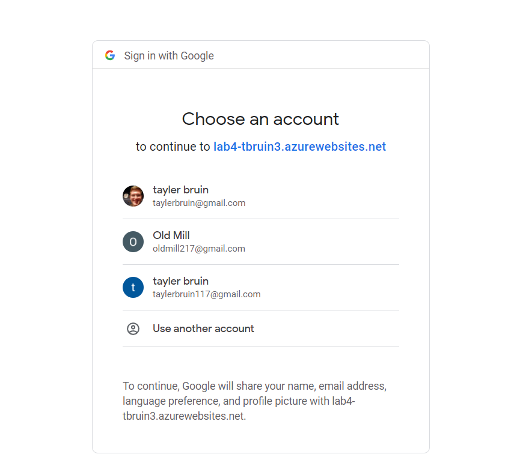
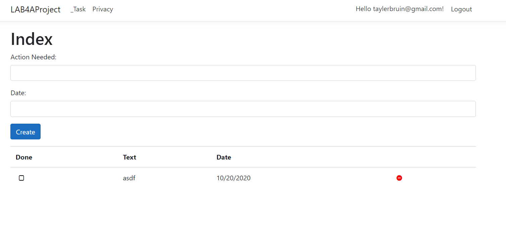

# INTRODUCTION:
### Tayler Bruin  
### 03/15/2022  
### Lab 4 Writeup  
# SUMMARY:
The purpose of this lab was to create a website using a NOSQL database and the microsoft Azure platform. The website would allow for users to
log in and register using either a user provided email and password or Google authentication with OAuth2. After logging into the website the user
would be able to view a task list, add tasks to the list, check the tasks off, and delete the tasks. This project involved using Visual Studio 2022,
the C# language and the model view controller framework to generate code and then edit that generated code.
# DESIGN OVERVIEW:
**index.cshtml:** This page houses the view for the whole project. The other view pages are not used. This allows tasks to be outputted correctly to the users browser and for users to be able to interact with the website.  
**_Task.cs:** This holds the model for the controller and all of the get and set functions for the different variables in the task objects.  
**Data Folder:** This holds varies files that control connection to the database on mongodb. Most of these hold password strings to allow for connections to be possible. TaskDao.cs holds CRUD logic for the database.  
**appsettings.json:** holds connection string for mongodb.  
**_TaskController.cs:** Holds logic for all CRUD functions. 
**site.css:** This houses all of the information for the browser to display the site correctly. It makes the site look nice.

Creates a new task

Removes a task from the list

This reads the task

This updates the task

This page allows the user to select login options.

This shows google working as a method for logging into the website.

This shows the main page for the site allowing users to add and delete tasks.  
# Questions:
1. In the context of MongoDB compared to SQL databases, what's a Document? What's a Collection?  
**Response:** A collections is basically a table. A document could be considered a row. The major difference is there is no join function with NOSQL databases.
2. When you log in with Google, where is the hash of your password stored? Your app, Google, or both?  
**Response:** The hash is only stored with google. Google returns a cookie saying that the user is authenticated and gives a way to identify them.
3. What's the difference between using Cloud services to store data (like Atlas) and storing data locally with something like MySQL? List 2 benefits of each approach.  
**Response:** Using cloud services can have many benefits. One it scales really well if your service grows it can easily grow alongside it. Two it often can have a lot of functionality prebuilt into the service itself that you don't have to create. Benefits to MySQL are that you can use things like a join function to make your project run smoother. If you set up your own servers you don't have to worry about someone elses service going down and causing your site to crash.
4. List 3 core features of fully-fledged IDE's like Visual Studio that give them an advantage over text-editors like Sublime or VSCode. 
**Response:** IDE's contain everything you need for your website to run so you don't need to use something like docker to add extra functionality. They work as compilers and that helps when debugging beyond just syntax errors. They allow for things like breakpoints and give more information when code is running.
5. What is the role of a Model? 
**Response:**
This communicates with the database. It holds the structure for the tasks that you are creating.
6. What is the role of a View? 
**Response:** This outputs the tasks to the browser correctly.
7. What is the role of a Controller? 
**Response:** This holds all of the logic of your site and acts as a communication layer between the Model and the View.
8. List 3 pros and 3 cons of hosting your website on the cloud. 
**Response:** Pro your site is more reliable. Pro it can be a lot cheaper to have someone else host your site than doing it yourself. Pro if your site needs to scale up it is really easy to do. Con you don't have complete control over your site. Con if the service you use goes down so does your site. Con when your site gets really big it becomes very expensive to host.
# LESSONS LEARNED:
### CODE GENERATORS DO A SURPRISING AMOUNT OF WORK FOR YOU
When working in visual studio with C# you will oftentimes generate code automatically. This can be tricky because you need to know exactly what settings you want or it will generate something you don't want. It is also tricky because when you don't write everything yourself you are not always sure what exactly everything is doing. However taking the time to do it and edit the files to be exactly what you need can save you a lot of time.
### JSON FORMAT CAN BE DIFFICULT TO WORK WITH
JSON can be useful for a great many things. It is primarily a method for storying data in a file. When you have to add a piece of data into the file it is really important that you look at the braces because if you get those wrong your program won't know how to read the file correctly. Make sure you look at the braces and that everything is in its write place so your code won't assume its part of something else.
### THERE ARE MANY THINGS THAT CAN GO WRONG PUBLISHING WITH AZURE
When publishing to Azure there are many settings that you have to define. Some of these are stored in the secrets.json file in your code and you need to add them into the settings so that your site will work properly. In JSON format strings need quotations around them to be read properly. When you are defining settings for the site however you do not need quote marks in fact they will break your site. This is not clear if you are just trying to copy and paste things but it is important to realize.
# CONCLUSIONS:
- Created a website that users can login, logout and register to.
- Storing users and tasks in server database.
- CRUD functions for tasks assigned to users and stored in a database.
- Model View Controller functionality with NOSQL database and C#
- Using an IDE
- Enabling Oauth for your website.
- Publishing on Microsoft Azure
# REFERENCES:
https://devblogs.microsoft.com/dotnet/introducing-c-source-generators/  

https://www.w3schools.com/cs/cs_classes.php

https://www.tutorialsteacher.com/mvc/viewdata-in-asp.net-mvc  